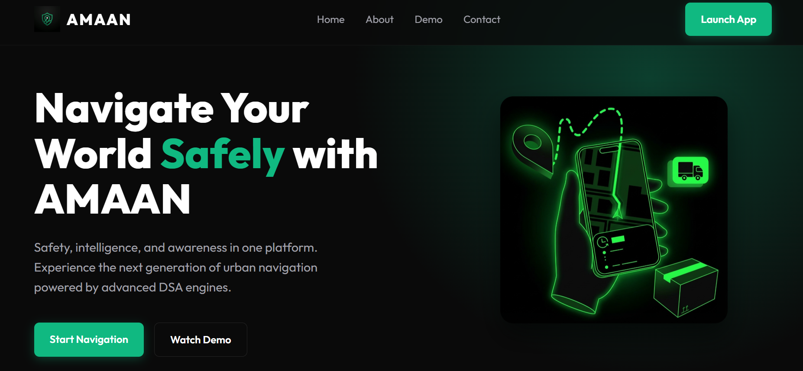
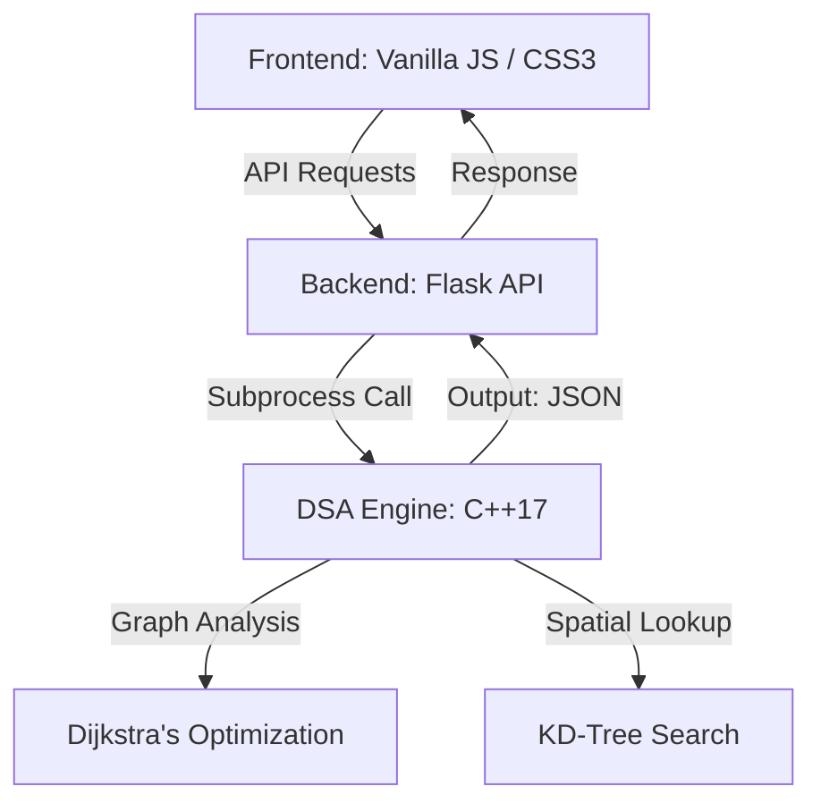

# 🛡️ AMAAN: AI-Powered Safety Navigation System

<div align="center">


**Intelligence-First Navigation optimized for Islamabad, Pakistan**

[](https://www.python.org/)
[](https://isocpp.org/)
[](https://flask.palletsprojects.com/)
[](https://opensource.org/licenses/MIT)

[Explore Features](#-core-features) • [View Architecture](#-system-architecture) • [Setup Guide](#-getting-started) • [DSA Deep Dive](#-dsa-implementation)

</div>

---

## 📖 Overview

**AMAAN** (Location Intelligence & Safety Navigation) is a mission-critical navigation system designed to prioritize **human safety** over simple route length. Developed specifically for the complex urban landscape of **Islamabad**, it leverages advanced Data Structures and Algorithms (DSA) to calculate the "Safest Path" by analyzing real-time hazards, emergency facility proximity, and historical safety data.


> [!NOTE]
> While Google Maps provides the base visualization, the **AMAAN DSA Engine** serves as the primary intelligence layer, evaluating every meter of the journey against a rigorous safety matrix.



---

## ✨ Core Features

### 🗺️ Intelligent Navigation
*   **Predictive Autocomplete**: High-performance indexing of Islamabad landmarks.
*   **Safety-Weighted Routing**: Routes are scored on a scale of 0-100 based on hazard density.
*   **Dynamic Rerouting**: Real-time adjustment when new hazards are detected.

### � Safety Intelligence
*   **Hazard Proximity Analysis**: Identifies construction zones, traffic congestion, and incident hotspots.
*   **Emergency Infrastructure Mapping**: Instant detection of the nearest Hospitals, Police Stations, and Fire Departments using spatial indexing.
*   **Visual Risk Assessment**: Glassmorphic UI overlays with color-coded safety indicators.

### 🎨 Premium User Experience
*   **Next-Gen Interface**: Modern dark-themed dashboard with responsive sidebars.
*   **Live Map Integration**: Seamless integration with Google Maps JS API.
*   **Real-Time Metrics**: Instant feedback on Distance, ETA, and Safety Score.

---

## 🏗️ System Architecture

AMAAN employs a decoupled architecture for maximum performance and scalability.



---

## 🧠 DSA Implementation

At its core, AMAAN is a showcase of sophisticated algorithms:

| Algorithm | Purpose | Efficiency |
| :--- | :--- | :--- |
| **Dijkstra's** | Multi-Factor Path Optimization | $O(E \log V)$ |
| **KD-Tree** | Nearest Emergency Facility Discovery | $O(\log N)$ |
| **Hash Map** | Rapid Location Indexing & Autocomplete | $O(1)$ |
| **Priority Queue** | Real-time Hazard Ranking | $O(\log N)$ |
| **Adjacency List** | Memory-Efficient Urban Graph Storage | $O(V + E)$ |

---

## 🚀 Getting Started

### Prerequisites
*   **Python 3.10+** (Flask, Flask-CORS)
*   **GCC/G++** (Supporting C++17)
*   **Modern Browser** (Chrome recommended)

### 1. Engine Compilation
```bash
cd backend/dsa_engine
g++ -std=c++17 graph.cpp kdtree.cpp dijkstra.cpp hazards.cpp main.cpp -o amaan_engine.exe
```

### 2. Backend Initialization
```bash
cd ../
pip install flask flask-cors
python app.py
```

### 3. Frontend Launch
Open `frontend/index.html` directly in your browser or host via:
```bash
cd frontend
python -m http.server 8000
```

---

## 📂 Project Structure

```text
AMAAN/
├── backend/            # Flask API & C++ DSA Core
│   └── dsa_engine/     # High-performance C++ Implementations
├── frontend/           # Modern Web Interface
│   ├── js/             # Application Logic & API Bridges
│   └── css/            # Premium Glassmorphic Styling
├── docs/               # Detailed Technical Documentation
└── assets/             # Branding & Visual Media
```

---

## 🤝 Contributing

We welcome contributions! Please refer to our [Contribution Guidelines](CONTRIBUTING.md) for more details.

---

## 📄 License

This project is licensed under the **MIT License**. See the [LICENSE](LICENSE) for the full text.

<div align="center">

**Built with Precision for the People of Islamabad**

[Report Issue](https://github.com/MAFA-KHAN/Amaan/issues) • [Request Feature](https://github.com/MAFA-KHAN/Amaan/issues)

</div>
