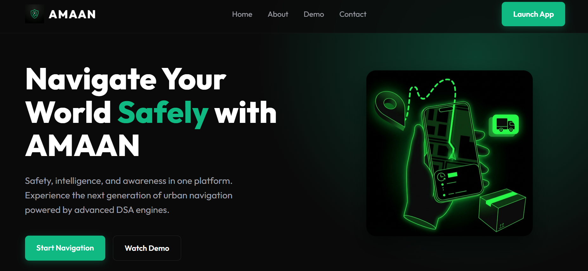

# AMAAN: Advanced Multi-Criteria Alert & Navigation🛡️🚦


> **"Google Maps provides the Eyes. AMAAN provides the Brain."**
> *~ Safety First, Speed Second.*

AMAAN detects hazards along your path and applies a "Weight Penalty" to dangerous road segments. If a protest is reported in Sector F-6, the engine automatically finds a safer detour through F-7, even if it adds a few minutes to your ETA.

<div align="center">
    
    <br>
    <h3><i>"Navigating Uncertainty, Delivering Safety."</i></h3>
</div>
<br>

---

## 🚀 Key Features

### 🌟 1. Safety-Aware Routing (The "Safe Path")
Using a modified **Dijkstra's Algorithm**, AMAAN detects hazards along your path and applies a "Weight Penalty" to dangerous road segments. If a protest is reported in Sector F-6, the engine automatically finds a safer detour through F-7, even if it adds a few minutes to your ETA.

### 📍 2. Spatial Partitioning (KD-Tree)
Searching for the nearest hospital or police station in a crisis needs to be instant. AMAAN uses a **k-Dimensional Tree (KD-Tree)** to perform nearest-neighbor searches in **Logarithmic Time ($O(\log N)$)**, ensuring millisecond response times even with thousands of locations.

### ⚡ 3. Hybrid Architecture
*   **Frontend:** Lightweight **Vanilla JavaScript** with Glassmorphism UI. Zero framework overhead.
*   **Middleware:** **Python (Flask)** handles API requests and JSON orchestration.
*   **Backend:** **C++17** Engine handles the heavy mathematical lifting (Graph Traversal, Spatial Search).

### 🔔 4. Real-Time Hazard Simulation
The system simulates a live feed from the Islamabad Traffic Police (ITP). Hazard severities fluctuate dynamically, ensuring the routing engine is always reacting to the latest "Ground Truth."

---

## 🛠️ Technology Stack

| Component | Technology | Role |
| :--- | :--- | :--- |
| **Frontend** | HTML5, CSS3, JS | User Interface & Map Rendering (Google Maps API) |
| **API Gateway** | Python (Flask) | REST API, Bridge to C++, JSON Parsing |
| **Logic Core** | C++ (MinGW G++) | Weighted Graph, Dijkstra, KD-Tree, Hazard Logic |
| **Data** | Mock Scraper | Simulates ITP / Twitter Alert Feeds |

---

## 🏁 Quick Start

### Prerequisites
*   Python 3.8+
*   G++ Compiler (MinGW for Windows)

### Installation
1.  **Clone the Repo:**
    ```bash
    git clone https://github.com/MAFA-KHAN/Amaan.git
    cd Amaan
    ```

2.  **Compile the Engine:**
    ```bash
    cd backend/dsa_engine
    g++ -O3 main.cpp graph.cpp dijkstra.cpp kdtree.cpp hazards.cpp -o amaan_engine.exe
    ```

3.  **Run the Backend:**
    ```bash
    cd ../
    python app.py
    # Server running at http://localhost:5000
    ```

4.  **Run the Frontend:**
    Open `frontend/index.html` (or `app.html`) in your browser using a local server (e.g., Live Server).

---

<div align="center">
    <b>Made by MAFA with ❤️</b>
</div>
