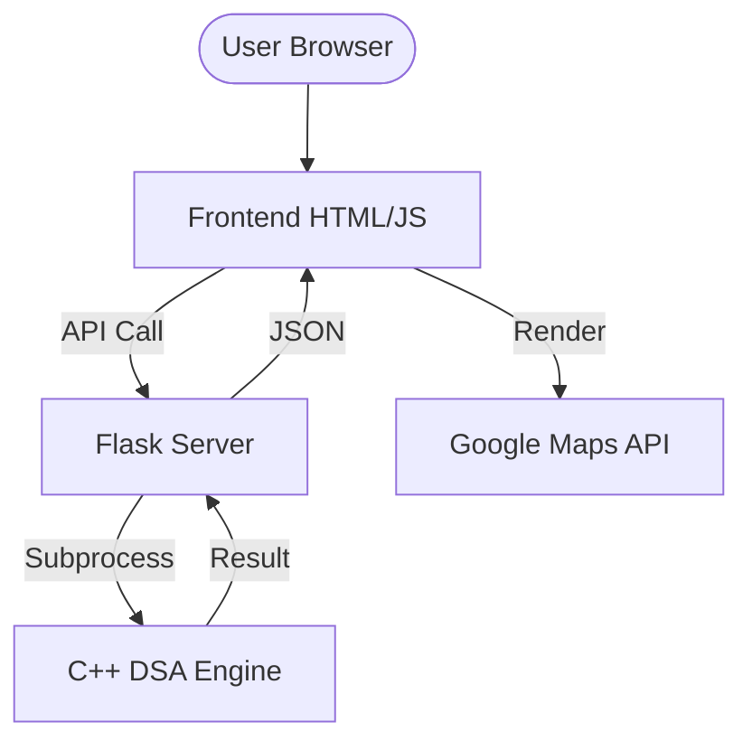

# AMAAN System Architecture

The AMAAN platform follows a decoupled multi-tier architecture to separate concerns between visualization, API orchestration, and high-performance computation.

## 1. Component Overview

### Frontend (User Interface)
- **Tech**: HTML5, Vanilla CSS3, JavaScript (ES6+).
- **Role**: Renders the Map UI, handles user input, and communicates with the Flask API.
- **External Integration**: Uses Google Maps JS API for rendering and base road geometry.

### Backend API (Orchestrator)
- **Tech**: Python Flask.
- **Role**: Serves as a bridge between the Web UI and the C++ DSA Core.
- **Functions**: Routes API requests, executes C++ subprocesses, and serves static data.

### DSA Core Engine (Computational Layer)
- **Tech**: C++ 17.
- **Role**: The "Brain" of the system. Performs safety-weighted pathfinding and spatial analysis.
- **Communication**: JSON-based output via standard streams.

## 2. Data Flow
1. **Request**: User enters a destination in the Frontend.
2. **Base Route**: Frontend fetches raw road data from Google Directions API.
3. **Safety Scan**: Flask sends the route and current hazard data to the C++ Engine.
4. **Scoring**: C++ calculates the `Safety Score` using a custom weighted Dijkstra algorithm.
5. **Response**: Flask returns the Safest Route and Safety Score to the Frontend.

## 3. Deployment Diagram (Simplified)

